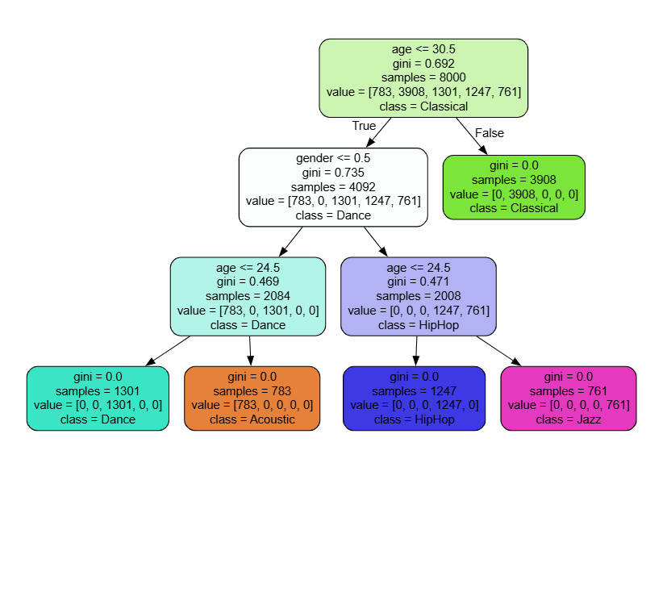

# Music Recommendation System

## Project Overview
This project is a **Music Recommendation System** that predicts the genre of music a user might like based on their age and gender. It uses a Decision Tree Classifier to make predictions and visualize the decision-making process.

## Libraries and Tools Used
- **Pandas**: For data manipulation and analysis.
- **Scikit-learn**: For machine learning algorithms and model evaluation.
- **Joblib**: For saving and loading the trained model.
- **Graphviz**: For visualizing the decision tree.

## Decision Tree Visualization
The decision tree used in this project is visualized to understand the model's decision-making process. Below is the graphical representation of the decision tree:



The decision tree splits the data based on the features `age` and `gender` to predict the music genre. Each node represents a decision point, and the leaves represent the predicted genres.

## Dataset Details
The model was trained on a synthetic dataset containing the following statistics:

| Rank       | Year       | NA_Sales   | EU_Sales   | JP_Sales   | Other_Sales | Global_Sales |
|------------|------------|------------|------------|------------|-------------|--------------|
| count      | 16598.000  | 16327.000  | 16598.000  | 16598.000  | 16598.000   | 16598.000    |
| mean       | 8300.605   | 2006.406   | 0.264667   | 0.146652   | 0.077782    | 0.048063     |
| std        | 4791.854   | 5.829      | 0.816683   | 0.505351   | 0.309291    | 0.188588     |
| min        | 1.000      | 1980.000   | 0.000000   | 0.000000   | 0.000000    | 0.000000     |
| 25%        | 4151.250   | 2003.000   | 0.000000   | 0.000000   | 0.000000    | 0.000000     |
| 50%        | 8300.500   | 2007.000   | 0.080000   | 0.020000   | 0.000000    | 0.010000     |
| 75%        | 12449.750  | 2010.000   | 0.240000   | 0.110000   | 0.040000    | 0.040000     |
| max        | 16600.000  | 2020.000   | 41.490000  | 29.020000  | 10.220000   | 10.570000    |

## Model Accuracy
The model achieved an accuracy score of **1.0** (100% accurate).
```
    score = accuracy_score(y_test, predictions)
    score
```

## Additional Notes
- The trained model is saved as `music-recommadation-system.joblib`.
- The decision tree is exported in `.dot` format for visualization.

Feel free to explore the code and modify it to suit your needs!